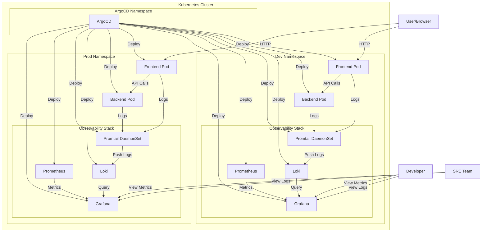
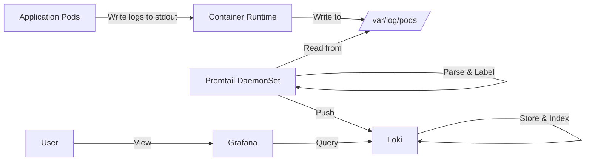
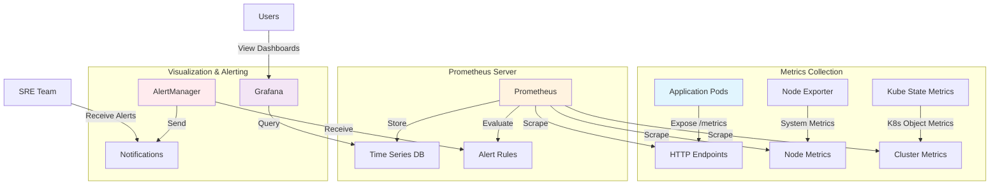
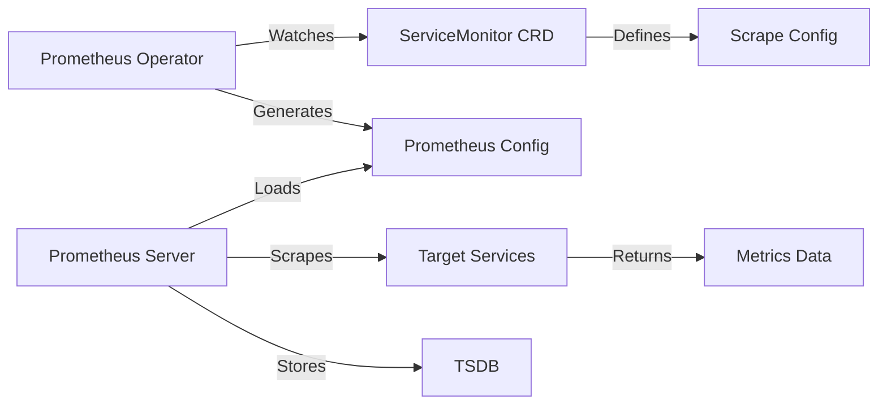

<<<<<<< HEAD
# E-commerce-Platform
Simple e-commerce website where users can browse products, add them to their cart, and make purchases. You can also implement user authentication (JWT-based login), an admin dashboard for managing products, and order history.


SharKApp
A production-ready Angular frontend and Node.js backend with DevOps automation.
Directory Structure

frontend/: Angular application code.
backend/: Node.js application code.
devops/: All DevOps configurations.
    charts/: Helm charts for deployment.
    environments/: Production and staging configurations.
    argocd/: ArgoCD manifests.
    terraform/: Infrastructure-as-code.
    scripts/: Automation scripts.

.github/workflows/: CI/CD pipelines.

Setup Instructions

Clone the repository: git clone https://github.com/your-org/SharKApp.git
Run bootstrap script: bash devops/scripts/bootstrap.sh
Verify deployment in ArgoCD UI.

Accessing Services

Grafana: kubectl port-forward svc/grafana -n monitoring 8081:80
Alertmanager: kubectl port-forward svc/prometheus-kube-prometheus-alertmanager -n monitoring 9093:9093
Jaeger: kubectl port-forward svc/jaeger-query -n monitoring 16686:16686

CI/CD

Frontend: Builds and tests Angular app, pushes Docker image.
Backend: Builds and tests Node.js app, pushes Docker image.
CD: Validates Helm charts and triggers ArgoCD sync.

Future Extensions

SLOs: Enable in devops/charts/monitoring/values.yaml.
Terraform: Expand devops/terraform/ for additional resources.

--------

# My Application

This project deploys a production-ready application using Kubernetes, Helm, and ArgoCD.

## Directory Structure
- `argocd/`: ArgoCD application manifests.
- `charts/`: Helm charts for application components.
- `config/`: Environment-specific configurations.
- `scripts/`: Automation scripts.
- `docs/`: Project documentation.

## Setup
1. Install Helm and ArgoCD.
2. Run `./scripts/bootstrap.sh`.
3. Deploy applications with `./scripts/deploy.sh`.
4. Validate with `./scripts/validate.sh`.

See `architecture.md` for details.


# Architecture

## Components
- **Backend**: REST API service.
- **Frontend**: Web UI.
- **Ingress**: NGINX ingress controller for routing.
- **Monitoring**: Prometheus, Grafana, Loki, Jaeger.

## Flow
- Ingress routes traffic to backend/frontend.
- Prometheus scrapes metrics from ServiceMonitors.
- Grafana visualizes metrics/logs/traces.
- ArgoCD manages deployments via GitOps.
---------

Monitoring: Use Prometheus to collect and store metrics from your application and Kubernetes cluster.
Logging: Use Fluent Bit to collect logs from application pods and forward them to a centralized logging system like Elasticsearch or Loki.
Alerting: Use Prometheus Alertmanager to define and manage alerts based on metrics.
Visualization: Use Grafana to visualize metrics and logs, integrated with Prometheus and the logging backend.
Helm: Package the observability stack as Helm charts for easy deployment and management.
ArgoCD: Manage the deployment of these Helm charts declaratively using GitOps principles.


| **Aspect**              | **Without Docker + NGINX**                                     | **With Docker + NGINX**                                             |
| ----------------------- | -------------------------------------------------------------- | ------------------------------------------------------------------- |
| **Environment Setup**   | Manual install on server (Node.js, npm, app code)              | Prepackaged image — runs anywhere Docker runs                       |
| **Reproducibility**     | Risk of “works on my machine, not on server”                   | Identical environment across dev, test, prod                        |
| **Deployment Process**  | Manual build + deploy steps, error-prone                       | Build once, ship Docker image, deploy consistently                  |
| **Scaling Up**          | Manual setup for each instance                                 | Easily run multiple container replicas (docker-compose, Kubernetes) |
| **Rollback**            | Must manually revert files/configs                             | Roll back to previous Docker image instantly                        |
| **Static File Serving** | Maybe rely on `ng serve` or raw file server                    | NGINX optimized for static assets                                   |
| **Compression**         | Likely missing, slower load                                    | Gzip compression by NGINX                                           |
| **Caching**             | No long-term asset caching                                     | 30-day caching for JS, CSS, images (faster repeat loads)            |
| **SPA Routing**         | Refresh on Angular routes causes 404                           | Handled by NGINX with `try_files /index.html` fallback              |
| **Security Headers**    | Must add manually (if remembered)                              | Predefined secure headers in nginx.conf                             |
| **Concurrent Requests** | Weak handling under high load (`ng serve` not designed for it) | NGINX handles thousands of concurrent connections efficiently       |
| **CI/CD Integration**   | Custom scripts per environment                                 | Standardized Docker-based pipelines                                 |
| **Portability**         | Tightly coupled to the specific server setup                   | Portable across any machine/cloud supporting Docker                 |


TODO
1. Create DB (MongoDB) related pod and use it in our project
Currently, you’re using MongoDB Atlas, but for a production-ready setup, hosting MongoDB in your Kubernetes cluster ensures better control, cost management, and integration with your existing setup. This should be the first step to establish a self-managed database.
2. Use Loki for log management
Since you’ve already started integrating Loki in your dev namespace (as seen in infra/config/dev/monitoring/loki/), setting up log management next ensures you can monitor and debug your application effectively as you make changes.
3. Use Grafana and Prometheus (clarify Grafana vs. Grafana Tempo)
Prometheus is ideal for metrics collection and alerting, and Grafana for visualization. Grafana Tempo is for distributed tracing, which isn’t a priority yet since you haven’t mentioned tracing needs. We’ll set up Grafana with Prometheus for metrics monitoring, as it aligns with your existing setup.
4. Use SLO for alert
Once metrics are in place with Prometheus and Grafana, you can define Service Level Objectives (SLOs) and set up alerts to ensure your application meets reliability goals. This builds on the previous step.
5. Use Terraform
Terraform can be used to manage your infrastructure as code (e.g., Kubernetes cluster, AWS resources). This comes after setting up core observability, as it’s more about infrastructure automation.
6. Use AWS services
Finally, integrating AWS services (e.g., EKS for Kubernetes, S3 for storage) can enhance scalability and reliability. This is the last step since it may involve migrating or enhancing your existing setup.
=======
# E-Commerce Platform with DevSecOps + GitOps Pipeline

## DevSecOps + GitOps Pipeline Overview


Our comprehensive DevSecOps + GitOps pipeline integrates security, automation, and observability throughout the entire software delivery lifecycle. The pipeline includes:

- **🔄 CI Pipeline**: Developer → GitHub → Jenkins CI → OWASP → SonarQube → Trivy → Docker
- **🚀 CD Pipeline**: Jenkins CD → GitHub → ArgoCD → Kubernetes
- **📊 Monitoring & Alerting**: Prometheus/Grafana/Loki → Alertmanager → Email/Slack

## Table of Contents

- [Architecture](#architecture)
- [Observability Stack](#observability-stack)
- [Monitoring with Prometheus](#monitoring-with-prometheus)
- [Logging with Loki](#logging-with-loki)
- [Quick Start](#quick-start)
- [Log Queries](#log-queries)
- [Configuration](#configuration)
- [Dashboards](#dashboards)
- [Useful Links](#useful-links)
- [Troubleshooting](#troubleshooting)
- [Project Structure](#project-structure)

## Architecture



### Log Flow Architecture



### Prometheus Metrics Flow



### ServiceMonitor Discovery



## Observability Stack

Our e-commerce platform includes a comprehensive observability stack:

- **📈 Metrics**: Prometheus + Grafana for application and infrastructure monitoring
- **📜 Logs**: Loki + Promtail + Grafana for centralized log aggregation
- **🔍 Traces**: Coming soon with Jaeger integration!
- **🚨 Alerts**: Prometheus AlertManager for proactive monitoring
- **📄 Dashboards**: Pre-built Grafana dashboards for quick insights

## Monitoring with Prometheus


We've implemented Prometheus for comprehensive metrics collection:

- **Prometheus Server**: Metrics collection and storage
- **Node Exporter**: System-level metrics
- **Kube State Metrics**: Kubernetes object metrics
- **ServiceMonitors**: Automatic service discovery
- **AlertManager**: Alert routing and notifications

### Key Metrics

- ✅ Application performance (response time, throughput)
- ✅ Infrastructure health (CPU, memory, disk)
- ✅ Kubernetes cluster state
- ✅ Custom business metrics
- ✅ SLI/SLO monitoring

### Common PromQL Queries

```promql
# CPU usage by pod
rate(container_cpu_usage_seconds_total[5m])

# Memory usage percentage
(container_memory_working_set_bytes / container_spec_memory_limit_bytes) * 100

# HTTP request rate
rate(http_requests_total[5m])

# Error rate percentage
(rate(http_requests_total{status=~"5.."}[5m]) / rate(http_requests_total[5m])) * 100

# 95th percentile response time
histogram_quantile(0.95, rate(http_request_duration_seconds_bucket[5m]))
```

## Logging with Loki


We've implemented Grafana Loki for centralized logging with:

- **Loki**: Log storage and query engine
- **Promtail**: Log collector on each node
- **Grafana**: Visualization dashboard

### Key Features

- ✅ Multi-environment support (dev/prod)
- ✅ Application-specific log streams
- ✅ Consistent labeling for easy filtering
- ✅ Resource-efficient storage

## Quick Start

### One-Click Setup

Run our setup script to deploy the entire stack:

```bash
./setup.sh
```

### Manual Setup

1. Deploy infrastructure:
```bash
kubectl apply -f infra/config/dev/values.yaml
```

2. Access Grafana:
```
Username: admin
Password: devadmin123 (dev) or SecurePassword123! (prod)
```

## Log Queries


### Common Queries

```
# All backend logs
{app="backend"}

# Frontend errors
{app="frontend"} |= "error"

# API requests with status code
{app="backend"} |~ "api|endpoint" | json | status_code >= 400
```

## Configuration

### Development Environment

```yaml
# Minimal resources for local development
loki:
  resources:
    limits:
      cpu: 200m
      memory: 256Mi
```

### Production Environment

```yaml
# Production-grade setup
loki:
  loki:
    limits_config:
      retention_period: 30d
  singleBinary:
    resources:
      limits:
        cpu: 1000m
        memory: 2Gi
```

## Dashboards

Access pre-built dashboards:

- Application Overview: `/d/app-overview`
- Error Monitoring: `/d/error-monitoring`
- Performance Metrics: `/d/performance`

## Useful Links

### Prometheus & Monitoring
- [Prometheus Documentation](https://prometheus.io/docs/)
- [PromQL Query Language](https://prometheus.io/docs/prometheus/latest/querying/basics/)
- [Grafana Dashboards](https://grafana.com/grafana/dashboards/)
- [Prometheus Operator](https://prometheus-operator.dev/)
- [AlertManager Configuration](https://prometheus.io/docs/alerting/latest/alertmanager/)

### Loki & Logging
- [Grafana Loki Documentation](https://grafana.com/docs/loki/latest/)
- [LogQL Query Language](https://grafana.com/docs/loki/latest/logql/)
- [Kubernetes Logging Best Practices](https://kubernetes.io/docs/concepts/cluster-administration/logging/)
- [Promtail Configuration](https://grafana.com/docs/loki/latest/clients/promtail/configuration/)

### Kubernetes & Observability
- [Kubernetes Monitoring Guide](https://kubernetes.io/docs/tasks/debug-application-cluster/resource-usage-monitoring/)
- [SRE Best Practices](https://sre.google/sre-book/table-of-contents/)
- [Observability Patterns](https://www.oreilly.com/library/view/observability-engineering/9781492076438/)

## Troubleshooting

Common issues and solutions:

| Issue | Solution |
|-------|----------|
| No logs appearing | Check Promtail pods: `kubectl get pods -n dev -l app=promtail` |
| Missing labels | Verify configmap: `kubectl describe configmap promtail-config -n dev` |
| Query timeout | Adjust time range or add filters to narrow results |

## Project Structure

```
e-commerce/
├── frontend/                   # Angular frontend application
├── backend/                    # Node.js API backend
├── setup.sh                    # One-click deployment script
├── docs/                       # Documentation
│   └── infrastructure-diagram.md   # Detailed architecture diagrams
└── infra/                      # Infrastructure as Code
    ├── addons/                 # Helm charts for services
    │   ├── loki/               # Logging stack (Loki + Promtail)
    │   ├── prometheus-stack/   # Metrics stack (Prometheus + Grafana)
    │   ├── backend/            # Backend application chart
    │   ├── frontend/           # Frontend application chart
    │   └── ingress/            # Ingress controller
    └── config/                 # Environment-specific configurations
        ├── dev/                # Development environment
        │   ├── app/            # Application configs
        │   └── monitoring-system/ # Observability configs
        └── prod/               # Production environment
            ├── app/            # Application configs
            └── monitoring-system/ # Observability configs
```
>>>>>>> 10efdd97221964535597c2e8cecef16614e283e2
