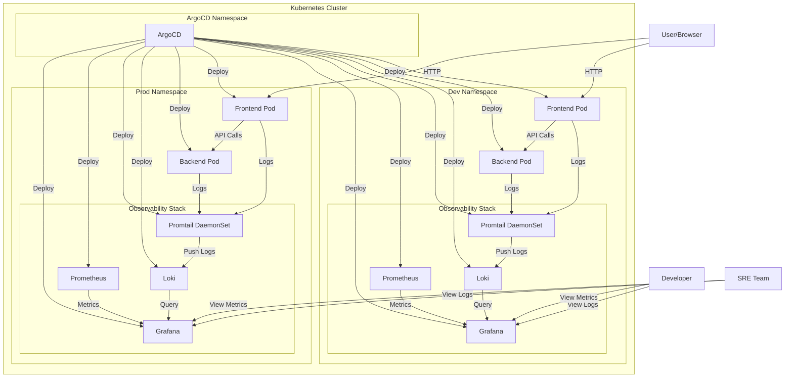
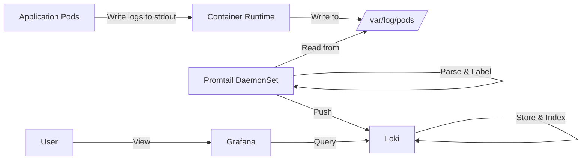
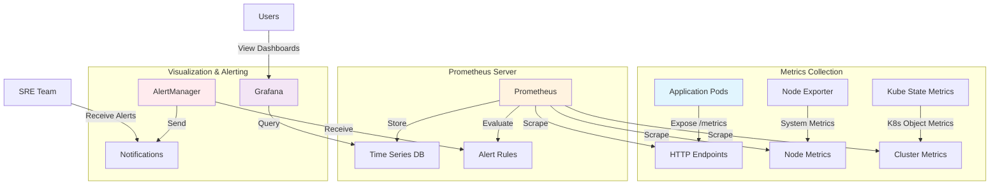
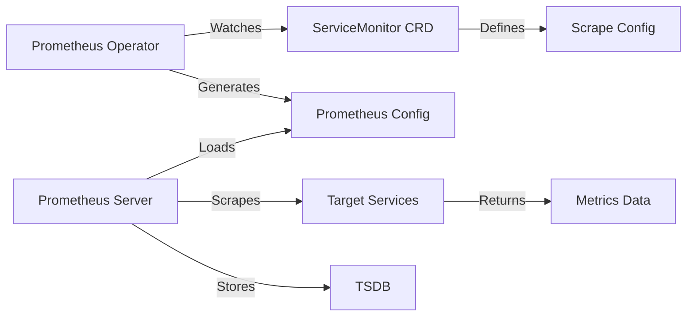

# E-Commerce Platform with DevSecOps + GitOps Pipeline

## DevSecOps + GitOps Pipeline Overview


Our comprehensive DevSecOps + GitOps pipeline integrates security, automation, and observability throughout the entire software delivery lifecycle. The pipeline includes:

- **🔄 CI Pipeline**: Developer → GitHub → Jenkins CI → OWASP → SonarQube → Trivy → Docker
- **🚀 CD Pipeline**: Jenkins CD → GitHub → ArgoCD → Kubernetes
- **📊 Monitoring & Alerting**: Prometheus/Grafana/Loki → Alertmanager → Email/Slack

## Table of Contents

- [Architecture](#architecture)
- [Observability Stack](#observability-stack)
- [Monitoring with Prometheus](#monitoring-with-prometheus)
- [Logging with Loki](#logging-with-loki)
- [Quick Start](#quick-start)
- [Log Queries](#log-queries)
- [Configuration](#configuration)
- [Dashboards](#dashboards)
- [Useful Links](#useful-links)
- [Troubleshooting](#troubleshooting)
- [Project Structure](#project-structure)

## Architecture



### Log Flow Architecture



### Prometheus Metrics Flow



### ServiceMonitor Discovery



## Observability Stack

Our e-commerce platform includes a comprehensive observability stack:

- **📈 Metrics**: Prometheus + Grafana for application and infrastructure monitoring
- **📜 Logs**: Loki + Promtail + Grafana for centralized log aggregation
- **🔍 Traces**: Coming soon with Jaeger integration!
- **🚨 Alerts**: Prometheus AlertManager for proactive monitoring
- **📄 Dashboards**: Pre-built Grafana dashboards for quick insights

## Monitoring with Prometheus


We've implemented Prometheus for comprehensive metrics collection:

- **Prometheus Server**: Metrics collection and storage
- **Node Exporter**: System-level metrics
- **Kube State Metrics**: Kubernetes object metrics
- **ServiceMonitors**: Automatic service discovery
- **AlertManager**: Alert routing and notifications

### Key Metrics

- ✅ Application performance (response time, throughput)
- ✅ Infrastructure health (CPU, memory, disk)
- ✅ Kubernetes cluster state
- ✅ Custom business metrics
- ✅ SLI/SLO monitoring

### Common PromQL Queries

```promql
# CPU usage by pod
rate(container_cpu_usage_seconds_total[5m])

# Memory usage percentage
(container_memory_working_set_bytes / container_spec_memory_limit_bytes) * 100

# HTTP request rate
rate(http_requests_total[5m])

# Error rate percentage
(rate(http_requests_total{status=~"5.."}[5m]) / rate(http_requests_total[5m])) * 100

# 95th percentile response time
histogram_quantile(0.95, rate(http_request_duration_seconds_bucket[5m]))
```

## Logging with Loki


We've implemented Grafana Loki for centralized logging with:

- **Loki**: Log storage and query engine
- **Promtail**: Log collector on each node
- **Grafana**: Visualization dashboard

### Key Features

- ✅ Multi-environment support (dev/prod)
- ✅ Application-specific log streams
- ✅ Consistent labeling for easy filtering
- ✅ Resource-efficient storage

## Quick Start

### One-Click Setup

Run our setup script to deploy the entire stack:

```bash
./setup.sh
```

### Manual Setup

1. Deploy infrastructure:
```bash
kubectl apply -f infra/config/dev/values.yaml
```

2. Access Grafana:
```
Username: admin
Password: devadmin123 (dev) or SecurePassword123! (prod)
```

## Log Queries


### Common Queries

```
# All backend logs
{app="backend"}

# Frontend errors
{app="frontend"} |= "error"

# API requests with status code
{app="backend"} |~ "api|endpoint" | json | status_code >= 400
```

## Configuration

### Development Environment

```yaml
# Minimal resources for local development
loki:
  resources:
    limits:
      cpu: 200m
      memory: 256Mi
```

### Production Environment

```yaml
# Production-grade setup
loki:
  loki:
    limits_config:
      retention_period: 30d
  singleBinary:
    resources:
      limits:
        cpu: 1000m
        memory: 2Gi
```

## Dashboards

Access pre-built dashboards:

- Application Overview: `/d/app-overview`
- Error Monitoring: `/d/error-monitoring`
- Performance Metrics: `/d/performance`

## Useful Links

### Prometheus & Monitoring
- [Prometheus Documentation](https://prometheus.io/docs/)
- [PromQL Query Language](https://prometheus.io/docs/prometheus/latest/querying/basics/)
- [Grafana Dashboards](https://grafana.com/grafana/dashboards/)
- [Prometheus Operator](https://prometheus-operator.dev/)
- [AlertManager Configuration](https://prometheus.io/docs/alerting/latest/alertmanager/)

### Loki & Logging
- [Grafana Loki Documentation](https://grafana.com/docs/loki/latest/)
- [LogQL Query Language](https://grafana.com/docs/loki/latest/logql/)
- [Kubernetes Logging Best Practices](https://kubernetes.io/docs/concepts/cluster-administration/logging/)
- [Promtail Configuration](https://grafana.com/docs/loki/latest/clients/promtail/configuration/)

### Kubernetes & Observability
- [Kubernetes Monitoring Guide](https://kubernetes.io/docs/tasks/debug-application-cluster/resource-usage-monitoring/)
- [SRE Best Practices](https://sre.google/sre-book/table-of-contents/)
- [Observability Patterns](https://www.oreilly.com/library/view/observability-engineering/9781492076438/)

## Troubleshooting

Common issues and solutions:

| Issue | Solution |
|-------|----------|
| No logs appearing | Check Promtail pods: `kubectl get pods -n dev -l app=promtail` |
| Missing labels | Verify configmap: `kubectl describe configmap promtail-config -n dev` |
| Query timeout | Adjust time range or add filters to narrow results |

## Project Structure

```
e-commerce/
├── frontend/                    # React frontend application
├── backend/                     # Node.js API backend
├── setup.sh                    # One-click deployment script
├── docs/                       # Documentation
│   └── infrastructure-diagram.md   # Detailed architecture diagrams
└── infra/                      # Infrastructure as Code
    ├── addons/                 # Helm charts for services
    │   ├── loki/               # Logging stack (Loki + Promtail)
    │   ├── prometheus-stack/   # Metrics stack (Prometheus + Grafana)
    │   ├── backend/            # Backend application chart
    │   ├── frontend/           # Frontend application chart
    │   └── ingress/            # Ingress controller
    └── config/                 # Environment-specific configurations
        ├── dev/                # Development environment
        │   ├── app/            # Application configs
        │   └── monitoring-system/ # Observability configs
        └── prod/               # Production environment
            ├── app/            # Application configs
            └── monitoring-system/ # Observability configs
```