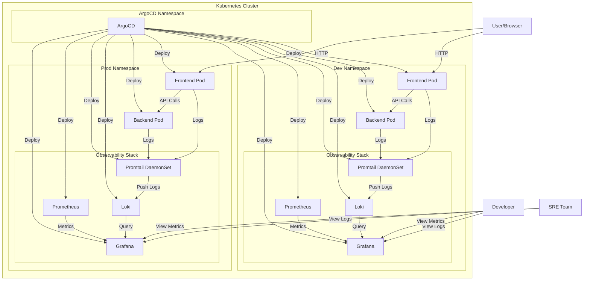
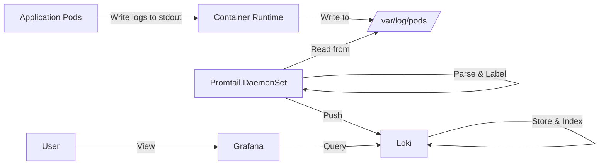

# E-Commerce Platform Infrastructure Diagram

## Log Flow Details

## Component Details

### Logging Components

- **Loki**: Log aggregation system
- **Promtail**: Log collector that runs on each node
- **Grafana**: Visualization platform for logs and metrics

### Application Components

- **Frontend**: React-based web interface
- **Backend**: Node.js API service
- **Database**: MongoDB database (not shown in diagram)

### Infrastructure Components

- **ArgoCD**: GitOps continuous delivery tool
- **Kubernetes**: Container orchestration platform